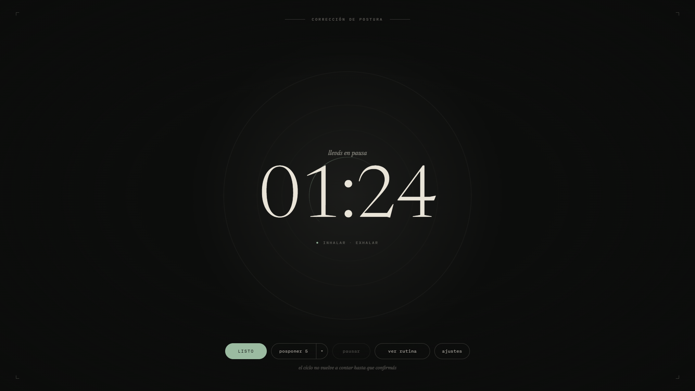
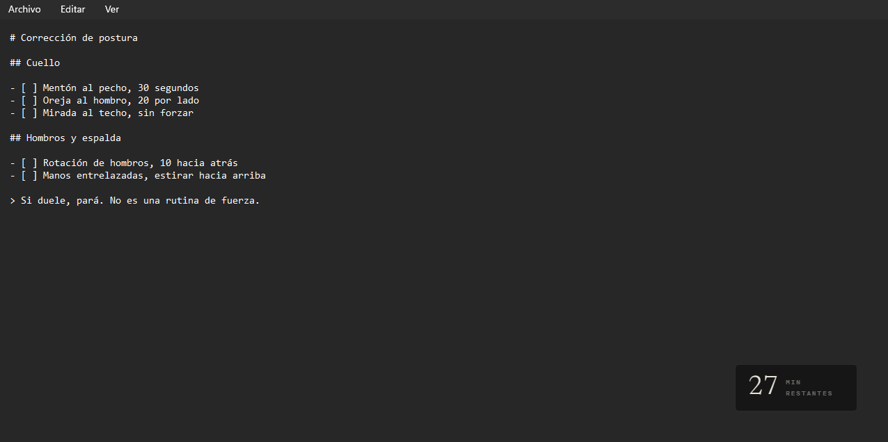
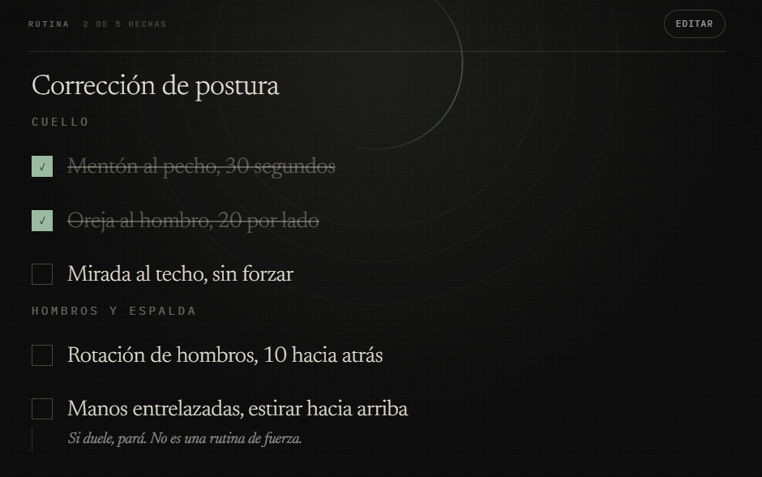

# Cairn

**Cada 45 minutos, una pausa que te espera.** Un temporizador de pausas para
Windows 10 y 11 que avisa cuándo parar y **no vuelve a contar hasta que
confirmás que terminaste** — no cuando se cumple el tiempo.

El intervalo es configurable, así que sirve igual como pomodoro o para
cronometrar cualquier otra cosa. Nació para una rutina de corrección de postura.

[**Descargar para Windows**](https://github.com/Kobyuu/Cairn/releases/latest) ·
2,7 MB · gratis · sin cuenta · sin conexión ·
[cairn-roan.vercel.app](https://cairn-roan.vercel.app)



> **Windows va a avisarte que no reconoce al editor.** Es porque Cairn no está
> firmado: un certificado de código cuesta entre 200 y 580 dólares por año y,
> desde 2024, ni siquiera evita ese aviso. Para instalarlo igual:
> **Más información → Ejecutar de todas formas**. El razonamiento completo está
> en [`SPEC-distribution.md`](docs/specs/SPEC-distribution.md) §4.

## Por qué existe

Un temporizador común te avisa y sigue contando, así que aprendés a ignorarlo.
Cairn no: al vencer se queda esperando. O confirmás **Listo**, o posponés. Ese
acto de confirmar *es* el producto — es lo que convierte el aviso en una pausa
de verdad.

Al vencer, Cairn conmuta a la pantalla de **Foco**, que **es** el aviso: no hay
un toast del sistema encima. Un cronómetro cuenta hacia arriba para medir cuánto
duró la pausa.

## Tres modos de presencia

Tan presente como quieras que sea. Se cambian desde la bandeja, y **cambiar de
modo nunca reinicia la cuenta**.

### Ambiente — tres píxeles y nada más

Una franja pegada al borde superior de la pantalla que se llena a lo largo del
ciclo. Sin ventana, sin texto, sin sonido. El mouse la atraviesa. Cuando falta
poco, engorda a cinco píxeles y respira.


### Widget — la cuenta en una esquina

Ventana chica sin bordes, arrastrable, que recuerda dónde la dejaste. Al pasar
el mouse aparecen los controles de pausa y de cambio de modo.



### Foco — la pantalla completa

Siempre encima. Es el aviso, y también un modo que podés dejar puesto todo el
día.

## La rutina

Un documento markdown editable desde la app, colapsado por defecto en Foco, con
listas de casillas que se marcan haciendo clic. Al confirmar la pausa, las
casillas se limpian solas.

Se guarda como un `.md` **real en disco**, no como una cadena dentro de la
configuración — porque va a crecer hacia un espacio de notas y tareas.



## Datos

Todo local. **Sin backend, sin red, sin telemetría y sin cuenta.** Los ajustes
van a `store.json` y el contenido a `notes/*.md`, ambos en el directorio de
datos de la app — texto plano que podés abrir con el Bloc de Notas y borrar
cuando quieras.

El código es público, así que esa promesa se puede verificar en vez de creer.

---

## Para desarrolladores

### Stack

**Tauri v2** (el `.exe` es un proceso Rust que hospeda ventanas de WebView2) +
**React** + **TypeScript** + **Vite** + **Tailwind v4**. Solo Windows.

El estado del temporizador vive en el core de Rust; las tres ventanas son vistas
que se suscriben a eventos. El vencimiento se guarda como un instante en hora de
pared y el restante se deriva contra el reloj del sistema, así que sobrevive a
que la PC se suspenda y despierte.

### Empezar

Prerrequisitos:

- [Rust](https://rustup.rs) con el toolchain `stable-x86_64-pc-windows-msvc`
- **MSVC C++ Build Tools** (Visual Studio Build Tools → «Desarrollo para el
  escritorio con C++»). Tauri linkea con el linker de MSVC, no con GNU.
- **WebView2 Runtime** — ya viene con Windows 11
- Node y **pnpm** (el proyecto usa pnpm, no npm)

```bash
pnpm install
pnpm tauri dev      # desarrollo
pnpm tauri build    # instalador en src-tauri/target/release/bundle/nsis/
```

**Verificación completa** — los cinco tienen que estar en verde:

```bash
pnpm lint
pnpm typecheck
pnpm test
cargo clippy --manifest-path src-tauri/Cargo.toml -- -D warnings
cargo test  --manifest-path src-tauri/Cargo.toml
```

### Documentación

| Documento | Qué contiene |
| --- | --- |
| [`docs/architecture.md`](docs/architecture.md) | Las decisiones D1–D9 y por qué se tomaron |
| [`docs/specs/CAPABILITY-MAP.md`](docs/specs/CAPABILITY-MAP.md) | Los seis módulos, su orden de construcción y las reglas comunes |
| [`docs/specs/`](docs/specs/) | Una spec por etapa, con criterios de aceptación y tests |
| [`docs/DESIGN.md`](docs/DESIGN.md) | **Sistema de diseño, normativo.** Lectura obligatoria antes de tocar `src/` |
| [`docs/design_handoff_cairn/`](docs/design_handoff_cairn/) | Handoff de Claude Design: las pantallas, la marca, el sistema web y el kit de capturas |
| [`CLAUDE.md`](CLAUDE.md) | Reglas del agente: flujo de trabajo, subagentes, y las trampas conocidas de Tauri v2 en Windows |

### Estado

Las seis etapas del capability map están cerradas —`bootstrap`, `timer-core`,
`system-integration`, `presence-modes`, `routine`, `visual-design`— y la app se
distribuye con instalador NSIS.

Fuera del capability map, porque es otro producto: la **landing pública** en
[`site/`](site/), HTML plano sin build.

Lo que viene: la rutina crece hacia un espacio de notas, tareas y recordatorios
en markdown, estilo Notion pero mínimo.

## Licencia

**Todos los derechos reservados.** El código es público para que se pueda leer y
auditar —Cairn promete que no hace red, y esto es lo que vuelve verificable esa
promesa—, pero no hay licencia de uso, copia ni redistribución. La app es
gratis; el código no es de dominio público.
